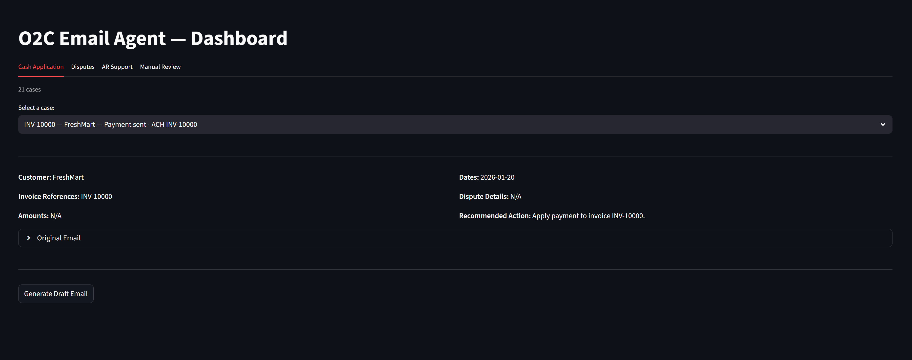
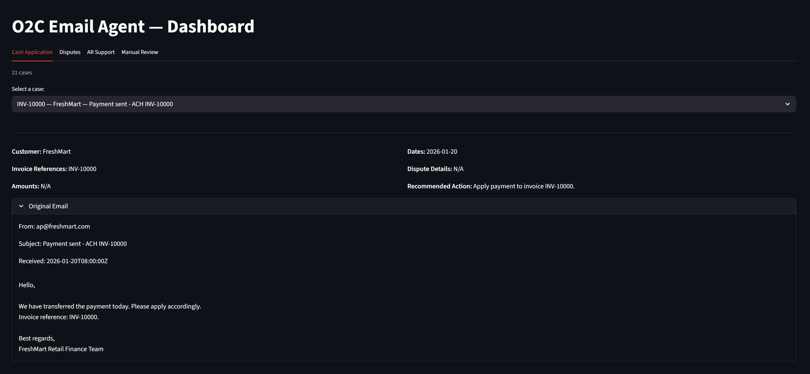
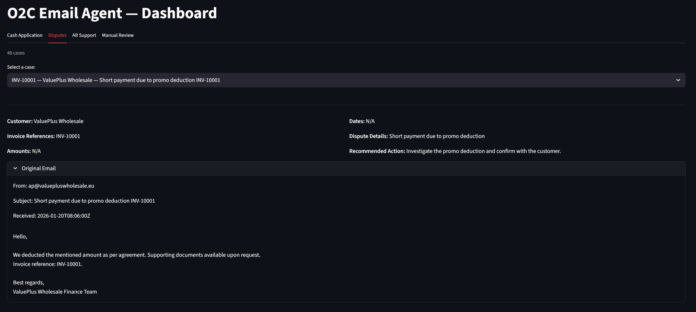
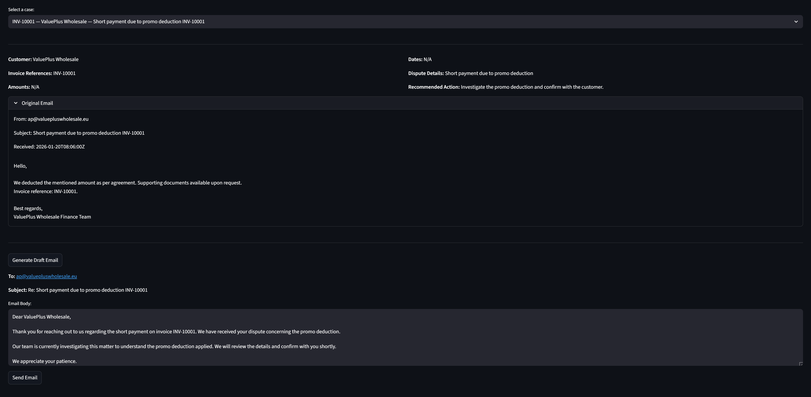

# O2C Email Agent

AR inboxes are a mess. Payment confirmations, disputes, invoice requests — all mixed together, all needing manual reading and routing. I built this to automate that.

## Demo






## What It Does

Classifies inbound accounts receivable emails using AI and routes them to the right queue automatically. Feed it a batch of emails, it spits out structured cases with recommended actions and a dashboard to manage them.

## Why I Built This

I got curious about how finance teams actually spend their time and realized a huge chunk of AR work is just reading emails and deciding what to do with them. Felt like a perfect problem for an LLM — unstructured input, clear output categories, high volume, low tolerance for mistakes. Wanted to see how far I could take it with a clean agentic pipeline.

## How It Works
```
data/Sample Emails.json
        ↓
src/classify.py  ←  Gemini AI (multi-key rotation)
        ↓
outputs/processed_cases.json
        ↓
src/app.py  ←  Streamlit dashboard
        ↓
Generate draft response  ←  src/email_generator.py
        ↓
outputs/sent_emails.json
```

The classifier runs as a batch job upfront — all the heavy AI work happens once. The dashboard is just reading JSON, so it's fast and snappy.

## Queues

| Queue | Category | Triggered By |
|-------|----------|--------------|
| Cash Application | Payment Claim | "We paid", "wire transferred", "remittance attached" |
| Disputes | Dispute | Short payment, pricing issue, damaged goods, credit note request, payment on hold |
| AR Support | General AR Request | Invoice copy, statement request, payment confirmation, proof of delivery |
| Manual Review | Error | API failures, classification errors |

## Setup

**1. Install dependencies**
```bash
pip install -r requirements.txt
```

**2. Add your API keys**
```bash
cp .env.example .env
# Edit .env and add your Gemini API keys
```

**3. Run the classifier**
```bash
python src/classify.py
```

**4. Launch the dashboard**
```bash
streamlit run src/app.py
```

## Rate Limits

Uses the free tier Gemini API. To stay within limits, the classifier rotates across multiple API keys (round-robin) and adds a 4-second delay between requests. If all keys hit their limit, it waits 15 seconds and retries before falling back to Manual Review.

## Why Multiple API Keys?

This is a personal project — I wasn't going to pay for API credits just to test something I built for fun.

Started with a single free Gemini key, hit the daily rate limit almost immediately. 100 emails was way too much volume for one free tier key. Instead of pulling out a credit card, I opened multiple Google accounts, grabbed a free API key from each, and built a rotation system that cycles through all of them automatically.

When one key hits its daily limit, the system moves to the next one without missing a beat. It's not elegant, but it works — and it cost exactly €0.

Honestly it ended up being better engineering anyway. The rotation logic forced me to think about resilience, retry strategies, and graceful degradation in a way I wouldn't have if I'd just paid for unlimited access.

## Tech Stack

- **Python** — core language
- **Google Gemini** (gemini-2.5-flash / gemini-2.0-flash) — classification + draft generation
- **Streamlit** — dashboard UI
- **JSON files** — storage (no database needed)
